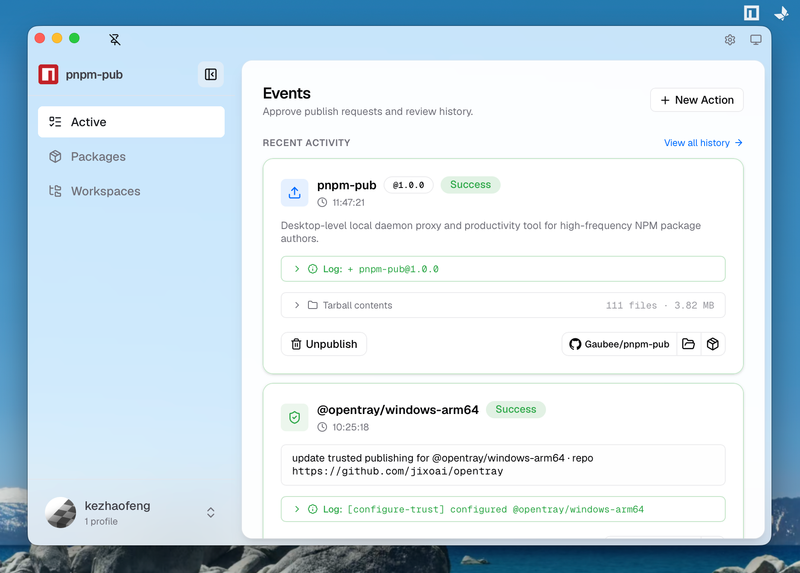

# pnpm-pub

**A desktop control plane for npm publishing.**

`pnpm-pub` turns a terminal publish command into a local, reviewable action: inspect the package, approve or reject it from the tray window, and let the waiting terminal continue only after that decision. It also gives npm package authors one place to manage identities, packages, workspaces, TOTP, and npm Trusted Publishing.



## Why pnpm-pub

Publishing is an external, irreversible action. The command line is excellent at describing intent, but it is a poor place to inspect a tarball, compare workspace packages, manage several npm identities, or interrupt a rushed release. pnpm-pub keeps the CLI as the source of action and adds a local review surface before npm is changed.

```text
pnpm-pub publish --access public
                |
                v
       local daemon creates a pending action
                |
                v
   tray window: inspect, approve, or reject
                |
                v
      confirmed action writes to npm; terminal receives result
```

The daemon starts on demand, so the normal workflow does not require a separate server-management step.

## What It Does

- **Approve publishes deliberately.** Review pending publish actions before the package is packed and sent to the registry. Rejecting an action cancels the waiting CLI process.
- **Inspect package work.** Browse your npm packages, package details, recent publish history, tarball contents, and workspace packages from one desktop surface.
- **Manage npm identities safely.** Add and switch profiles, scan a TOTP QR code or paste a secret, renew credentials, and keep credentials in macOS Keychain or Windows Credential Manager.
- **Set up Trusted Publishing with review.** Generate npm Trusted Publishing actions for GitHub Actions, GitLab CI, or CircleCI; confirmation is required before the npm trust configuration is changed.
- **Work with projects, not only one package.** Scan and pin package or pnpm workspace roots, then create actions against the packages they contain.
- **Keep a local audit trail.** The Events view records completed, rejected, cancelled, and failed actions alongside their relevant output.
- **Stay current deliberately.** Settings → About shows app/npm/pnpm versions and project links, checks npm's stable latest version daily, and offers an explicit in-app update only when the global package-manager owner is verified.

## Install

pnpm-pub supports macOS and Windows. Install it globally with Node.js 24+ and npm or pnpm:

```bash
npm install --global pnpm-pub

# or
pnpm add --global pnpm-pub
```

## First Publish

1. Start the desktop surface once and add an npm profile in the onboarding window. You can scan or paste the profile's TOTP secret there.

   ```bash
   pnpm-pub start
   ```

2. From a package directory, use `pnpm-pub` in place of `pnpm publish`.

   ```bash
   pnpm-pub publish --access public
   ```

3. Review the pending action in the tray window. Approve to publish, or reject to cancel the terminal command.

`pnpm-pub` preserves familiar publish arguments. Its explicit management commands are `start`, `status`, `stop`, `daemon`, `oidc`, `version`, and `help`; other arguments are handled as a publish request.

```bash
pnpm-pub status
pnpm-pub oidc --repo owner/repo --file publish.yml --env npm-release
pnpm-pub stop
```

## Documentation

- [CLI guide](docs/cli.md): lifecycle commands, publish interception, and Trusted Publishing actions.
- [Architecture](docs/architecture.md): the CLI, local daemon, native tray window, and action lifecycle.
- [Development](docs/development.md): source setup, local runtime, tests, and environment variables.
- [Contributing](CONTRIBUTING.md): project conventions and the contributor verification path.

## Security Model

pnpm-pub is local-first. The CLI, daemon, and tray window communicate over a local authenticated channel; credentials are stored by the operating system's native credential store. The UI does not make an npm write merely by rendering an action: an explicit user confirmation is the source that authorizes the registry mutation.

## License

[MIT](LICENSE)

## Links

- [LINUX DO — 中文开发者社区](https://linux.do/)
- [OpenTray](https://github.com/jixoai/opentray)
